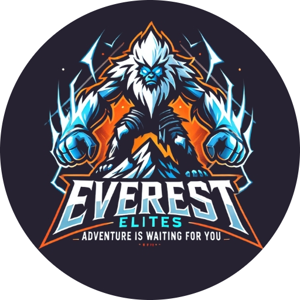

# legend_of_warriors

<table>
  <tr>
    <td></td>
    <td>
      

        <strong>Legend of Warriors</strong> is an exciting 2D combat-adventure game where players 
        engage in battles, explore the game world, and hunt for randomly placed treasures. 
        Some treasures provide power-ups and energy boosts, while others can weaken the player, 
        adding an element of strategy and unpredictability.
      

    </td>
  </tr>
</table>

# Everest Elites Reference
[Coding Standard](https://docs.google.com/document/d/1LwN1IsNJDbrkG7CQ_4cYRDVANrr4LlzVHY6VeJ2mtiI/edit?usp=sharing)

[RFP](/docs_folder/Final_RFP_EverestElites.pdf)

# CS383 class references
[Champion Document Resources](https://webpages.uidaho.edu/drbc/cs383/assignments/Champion.html)

[RFP Resources](https://webpages.uidaho.edu/drbc/cs383/assignments/RFP.html)

[Rough Presentation Walkthrough](https://webpages.uidaho.edu/drbc/cs383/assignments/04b_PresentationStoreyboard.pdf)

[SA Presentation resources](https://webpages.uidaho.edu/drbc/cs383/assignments/04b_PresentationMarkingKey.pdf)

[StoryBoard Marking Key](https://webpages.uidaho.edu/drbc/cs383/assignments/04b_StoryboardMarkingKey.pdf)

[CS 383 Homepage](https://webpages.uidaho.edu/drbc/cs383/index.html)
